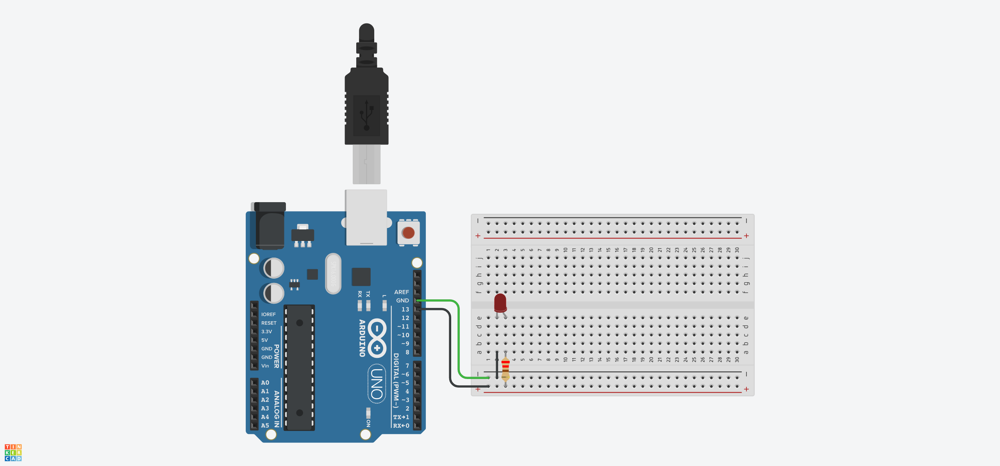

# Projeto Arduíno para manipular um led

## Contextualização

Neste experimento fiz com que o arduino manipulasse um led.

## Lista de componentes:

- Arduíno UNO R3
- Um cabo de conexão USB

## Esquema do projeto

## Projeto no Tinkercad

https://www.tinkercad.com/things/2LtGtfMTEZU

